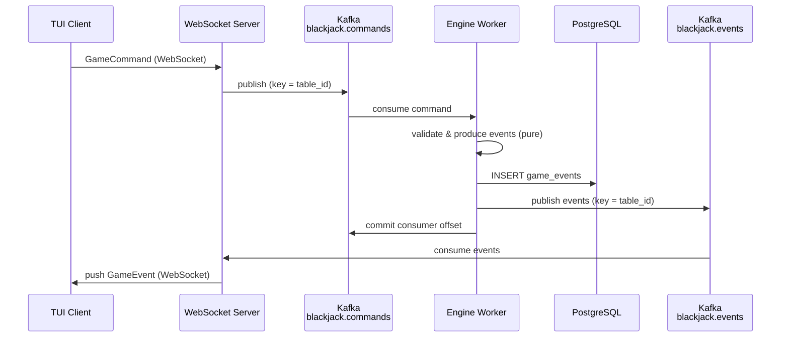

# ADR-0001: System Architecture

| Field | Value |
|---|---|
| **ID** | 0001 |
| **Date** | 2026-03-16 |
| **Status** | Accepted |
| **Deciders** | Engineering team |

---

<!--
  ADR TEMPLATE — copy this file when creating a new ADR.
  Fields:
    ID       Sequential zero-padded number (0002, 0003, …)
    Date     YYYY-MM-DD of the decision
    Status   Proposed | Accepted | Superseded by ADR-XXXX | Deprecated
    Deciders Who was involved

  Sections:
    ## Context      Why did this decision need to be made? What forces are at play?
    ## Decision     What was decided, stated plainly. Include diagrams/schemas if helpful.
    ## Consequences What becomes easier or harder as a result?
    ## Open Questions  Unresolved follow-on questions (promote to a new ADR when resolved)
-->

---

## Context

We are building a production-grade multiplayer blackjack engine that must support
thousands of concurrent tables, provide real-time event delivery to TUI clients,
and maintain a full audit trail. This ADR establishes the baseline architecture
that all subsequent decisions build on.

---

## Decision

### Deployable Units

| Service | Responsibility |
|---|---|
| **Engine Workers** | Consume player commands, run game logic, write to PostgreSQL, publish events to Kafka |
| **WebSocket Server** | Gateway between TUI clients and Kafka |
| **TUI Client** | Player-facing terminal UI |

---

### Data Flow



**Reliability via consumer offset**: the engine commits its Kafka consumer offset
only after both the PostgreSQL write and the Kafka publish succeed. If the engine
crashes at any point before the commit, it re-consumes the same command on restart.
The `UNIQUE (game_id, event_seq_id)` constraint makes the PostgreSQL write
idempotent, and at-least-once Kafka delivery is safe for downstream consumers.
No separate outbox mechanism is needed — the consumer offset is the resume point.

---

### Components

#### Engine Workers
- Both a Kafka **consumer** (consumer group `engine` on `blackjack.commands` and
  `blackjack.table-lifecycle`) and a Kafka **producer** (on `blackjack.events`).
- Each worker owns a set of Kafka partitions. Each partition = an execution lane
  for a slice of tables. **Many tables share a partition** — partitions are
  parallelism units, not per-table slots.
- Per partition: one `TablePartitionWorker` Tokio task holding
  `HashMap<TableId, TableState>` in memory.
- `TableState` wraps the active `GameState` plus table metadata. Stays warm across
  rounds — no rebuild between games at the same table.
- On partition assignment: load the active game's events from PostgreSQL and
  rebuild `TableState`. Cold-start only, not per-round.
- **Command loop**:
  ```
  poll command (key = table_id)
    → look up TableState  (lazy-init for new tables)
    → engine::handle(table, command)   // pure, no I/O
    → INSERT INTO game_events          // idempotent on retry
    → publish events to blackjack.events
    → commit consumer offset
    → apply events to in-memory TableState
  ```
- System-driven events (timeouts, dealer turns, phase transitions) are injected
  as `SystemCommand`s via a per-partition timer task, entering the same loop.
- **Table lifecycle**:
  - `TableCreated` → lazy-init a fresh `TableState` in the HashMap.
  - `TableClosed` → finish current round, reject new commands, drop `TableState`,
    cancel timers.

#### WebSocket Server
- Stateless. No game logic.
- On `JoinTable`: send a `GameStateSnapshot` rebuilt from PostgreSQL, then stream
  subsequent events consumed from `blackjack.events`.
- On `Command` from client: publish to `blackjack.commands` and return.
- Multiple instances behind a load balancer; each consumes Kafka independently.

#### TUI Client (`cli` crate)
- Connects to WebSocket server.
- Receives `GameStateSnapshot` on join, then applies arriving `GameEvent`s to
  local UI state.
- Sends `GameCommand`s (Hit, Stand, PlaceBet, …) to the server.

---

### Storage

#### Kafka Topics

| Topic | Partition key | Producers | Consumers |
|---|---|---|---|
| `blackjack.commands` | `table_id` | WebSocket servers | Engine workers |
| `blackjack.events` | `table_id` | Engine workers | WS servers, analytics (future) |
| `blackjack.table-lifecycle` | `table_id` | Admin API | Engine workers |

**One topic for all tables** — `table_id` is the message key, not the topic name.
Kafka hashes the key to a partition, preserving per-table ordering without creating
per-table topics (which would be an anti-pattern at scale).

**Partition count**: start with **2048** on `commands` and `events`.
Partitions are execution lanes — many tables share one partition safely at
blackjack's human pace. 2048 gives headroom without topic recreation.
Kafka partition count can never be decreased; over-provision upfront.

Rust Kafka client: **`rdkafka`** (librdkafka bindings).

#### PostgreSQL Schema

```sql
-- Append-only durable event log. Source of truth for cold-start state rebuild.
CREATE TABLE game_events (
    id            BIGSERIAL    PRIMARY KEY,
    game_id       UUID         NOT NULL,
    event_seq_id  BIGINT       NOT NULL,
    occurred_at   TIMESTAMPTZ  NOT NULL DEFAULT now(),
    payload       JSONB        NOT NULL,
    UNIQUE (game_id, event_seq_id)
);
CREATE INDEX game_events_game_id_seq ON game_events (game_id, event_seq_id);
```

#### EventStore trait (`bj-core` — no PostgreSQL dependency in domain)

```rust
pub trait EventStore: Send + Sync {
    async fn append(&self, game_id: GameId, expected_seq: u64, events: &[GameEvent])
        -> Result<(), EventStoreError>;
    async fn load(&self, game_id: GameId)
        -> Result<Vec<GameEvent>, EventStoreError>;
    async fn load_from(&self, game_id: GameId, from_seq: u64)
        -> Result<Vec<GameEvent>, EventStoreError>;
}
```

---

### Event Sourcing & CQRS

- All game state mutations are `GameEvent`s appended to the log — never direct
  state mutation.
- `GameState` is derived solely by replaying events.
- `GameEngine::handle(table: &TableState, cmd: GameCommand) -> Result<Vec<GameEvent>, CommandError>`
  is **pure** (no async, no I/O). All validation lives here.
- Write path: command → validate → produce events → persist (PG) → publish (Kafka) → commit offset.
- Read path: `GameStateSnapshot` rebuilt from `game_events` on demand.

---

### Ordering & Consistency

- Kafka partition key = `table_id` → all commands for a table arrive at the same
  worker in order. No optimistic concurrency needed on the hot path.
- Consumer offset committed last → on crash, the command is reprocessed from the
  same point. Combined with idempotent PG writes, this gives at-least-once
  processing with no duplicate state mutations.

---

### Scalability

- **Engine workers**: add processes → Kafka rebalances partitions automatically.
  Scale to match CPU core count, not table count.
- **Tables**: add/remove with no Kafka changes. New `table_id` hashes into an
  existing partition; worker lazy-inits `TableState` on first command.
- **Partitions**: 2048 handles thousands of tables at blackjack pace. Increase only
  when worker CPU is saturated.
- **WebSocket servers**: stateless, behind load balancer.
- **Snapshots** (future): write `TableState` snapshot after `GameFinished` to bound
  cold-start rebuild time.

---

## Consequences

**Positive**
- Simple, linear processing loop — no secondary tables or background processes.
- Consumer offset is the crash-recovery mechanism; no extra infrastructure needed.
- Pure `GameEngine::handle()` needs no infra in tests.
- One topic per direction regardless of table count — clean Kafka topology.

**Negative / Trade-offs**
- Engine workers are both Kafka consumers and producers; `rdkafka` native (C)
  dependency via librdkafka.
- At-least-once delivery: WS servers and other consumers must tolerate duplicate
  events (apply by `event_seq_id` ordering).
- 2048 partitions must be provisioned upfront.

---

## Open Questions

- **Snapshot store**: Redis or a `game_snapshots` PostgreSQL table?
- **Command rejections**: inline WebSocket response via correlation ID, or a
  `blackjack.command-rejections` Kafka topic?
- **Player balance**: PostgreSQL projection or part of `TableState`?
- **Auth**: JWT on WebSocket upgrade, or session token?
